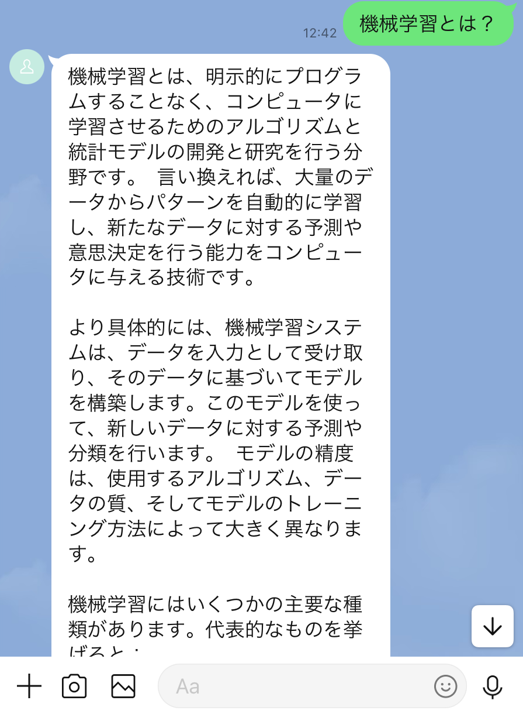

# 📚 Gemini × LINE 辞書Bot（FastAPI構成）

このBotは、LINEで「〇〇とは？」と送ると、**Google Gemini Flash モデル**を使ってやさしく意味を返す、辞書形式のAIチャットボットです。  
FastAPI + Render 無料枠で構築されており、学習用途・プロトタイプにも最適です。

---

## 🔧 使用技術スタック

| 項目         | 使用技術                         |
|--------------|----------------------------------|
| 言語         | Python 3.11                      |
| Webフレーム  | FastAPI                          |
| デプロイ     | Render（無料枠対応）            |
| LINE連携     | LINE Messaging API               |
| AIモデル     | Google Gemini 1.5 Flash          |
| ログ出力     | loguru                           |

---

## 📦 機能概要

- ユーザーが LINE に「〇〇とは？」と送信  
- Gemini API（Flashモデル）で定義・意味を生成  
- LINE Botが自動応答  
- 無料API枠で動作、QuotaエラーもLINE返信で通知  
- loguru によるログ記録でエラー追跡可能  

---

## ▶️ 動作イメージ

👤 ユーザー：機械学習とは？  
🤖 Bot　　：機械学習とは、データからパターンを学習し…



---

## 📁 ファイル構成

```
.
├── app.py               # Webhook受信＆LINE返信（FastAPIメイン処理）
├── requirements.txt     # ライブラリ定義
├── render.yaml          # Render用のサービス定義ファイル
├── Procfile             # Render実行定義
├── .env.example         # 環境変数テンプレート
└── README.md            # このファイル
```

---

## 🚀 セットアップ手順

### 1. 環境変数を設定（`.env` または Render上）

```env
LINE_CHANNEL_ACCESS_TOKEN=xxxxx
LINE_CHANNEL_SECRET=xxxxx
GOOGLE_API_KEY=xxxxx
MODEL_NAME=gemini-1.5-flash
```

### 2. Renderへデプロイ（無料プラン対応）

#### Renderアカウント作成
- https://render.com/ にアクセスし、GitHubと連携してログイン
- 新規 Web Service を作成

#### デプロイ手順

1. このプロジェクトを GitHub にPush
2. 「New Web Service」> GitHubリポジトリを選択
3. 以下のように設定：

| 項目 | 値 |
|------|----|
| Build Command | `pip install -r requirements.txt` |
| Start Command | `python app.py` または `uvicorn app:app --host 0.0.0.0 --port 10000` |
| Environment | Python 3.11（自動検出） |
| Port | 10000（Renderが自動スキャン） |

4. `.env` 内容を「Environment Variables」に追加

---

## 🤖 LINE Bot連携手順

### 1. LINE Developers でチャネル作成

- https://developers.line.biz/ にログイン
- プロバイダー作成後、以下の設定を行います

| 項目 | 設定内容例 |
|------|------------|
| チャネル種別 | Messaging API |
| チャネル名 | Gemini辞書Bot（任意） |
| チャネル説明 | Gemini APIを使った自動応答Bot |
| Webhook送信 | 「利用する」に設定 |
| チャネルアクセストークン | `.env` に設定 |
| チャネルシークレット | `.env` に設定 |

### 2. Webhook URL を設定

Renderデプロイ後のURLに `/callback` をつけて設定：

```
https://your-app-name.onrender.com/callback
```

- ✅ Webhookの利用 → 有効  
- ✅ 応答メッセージ → 有効  
- ✅ 自動応答メッセージ／あいさつメッセージ → 無効  

### 3. Botを「友だち追加」

- LINE Developers の「QRコード」またはLINE ID検索で追加
- テストメッセージ（例：「機械学習とは？」）で確認

---

## 📝 補足・工夫ポイント

- Gemini Flashモデル採用で高速×無料な応答実現  
- LINEの応答タイムアウト対策で非同期設計済み  
- loguru による強力なログ記録（トラブル追跡に便利）  
- `worker.py` による非同期処理も構築可能な設計

---

## 💡 将来の拡張案

- RedisによるタスクQueue処理（複数Botで分散対応）  
- AIモデルの切替（OpenAI / Claude など）  
- ログ/履歴管理によるユーザー対応の拡張  
- Web UIによるログビューや統計表示ダッシュボード

---

## 📮 連絡・著者

制作：**Tatsuya Kagawa（フリーランスエンジニア）**  


--

## 📄 ライセンス

本プロジェクトは [Tatsuya Kagawa](https://github.com/tkagawa218) によって作成されました。  
以下のライセンスのもとで公開されています：

**[CC BY 4.0（表示）](https://creativecommons.org/licenses/by/4.0/deed.ja)**

- 営利・非営利を問わず利用可能  
- 改変・再配布・派生利用も可能  
- クレジット（著作表示）の記載が必要です

© 2025 Tatsuya Kagawa

## 📖 関連リンク

- 📘 Zenn記事：[Gemini × LINEで作る辞書Bot｜FastAPIで爆速構築](https://zenn.dev/tkagawa218/articles/gemini-line-fastapi-bot)
